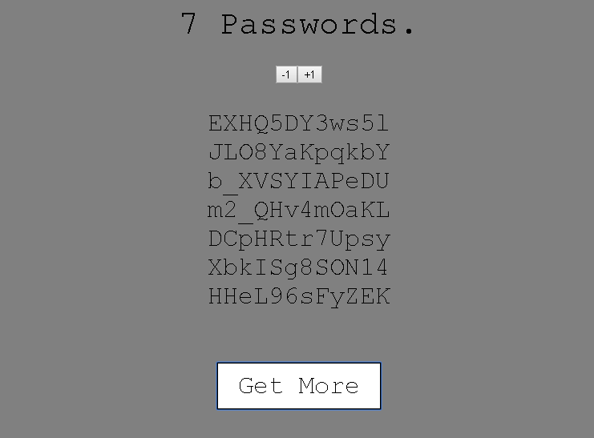

# Password Generator
> Generates between 1 and 15 passwords with 12 characters length each.



## Hosted version

  * [Click here to run a Heroku hosted version](https://passwordgenrand.herokuapp.com/)

## Usage example

Whatever you do, DO NOT use this to generate passwords for your personnal use.
This was made for learning purposes only.

## Development setup

Installing server/client packages:

```sh
yarn install && cd client && yarn install
```

Running the express server (with nodemon globally installed):

```sh
yarn run start-watch
```

or (without nodemon)

```sh
yarn start
```

Running the react app in development mode:

```sh
cd client\ && yarn start
```